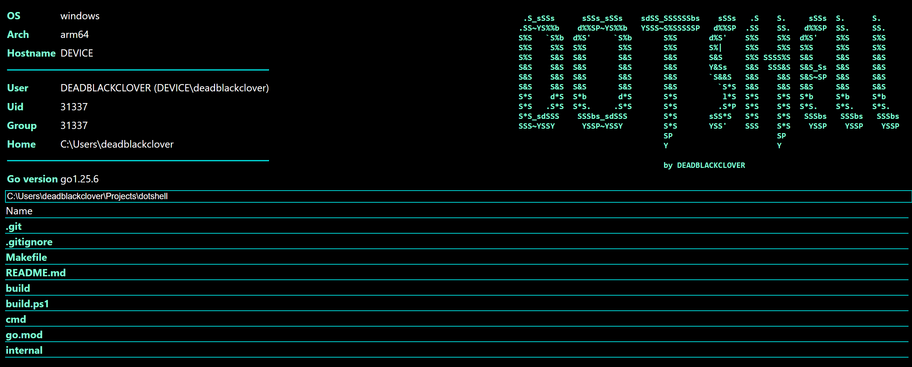

# dotshell



A web shell on Golang for remote management (file management, command execution, and more)

# Build
For linux:
```
make build
```
For Windows:
```
.\build.ps1 -Task build
```

# Run
For linux:
```
make run
```
For Windows:
```
pwsh -c { $env:HOST="0.0.0.0"; $env:USERNAME="root"; $env:PASSWORD="root"; .\build.ps1 -Task run }
```
